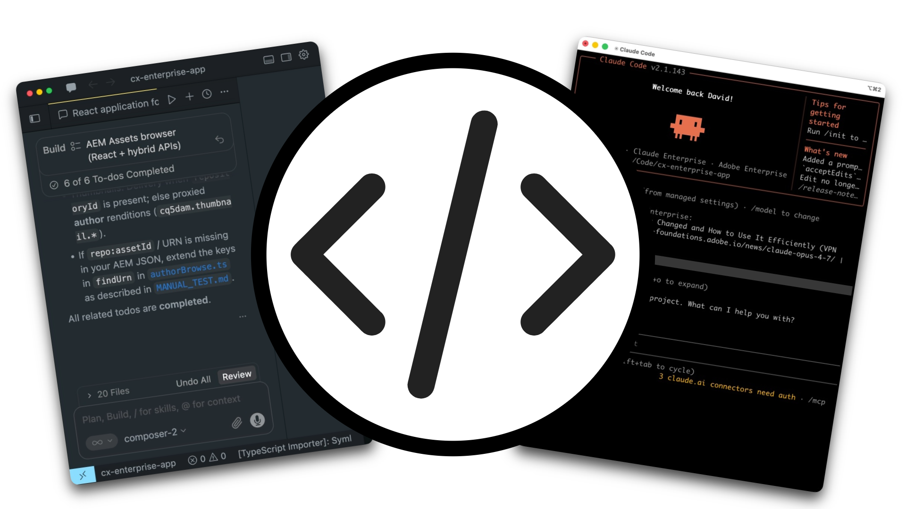

# API per builder

<!-- last-modified: 2026-06-02 -->



Le API Enterprise di Adobe CX consentono agli sviluppatori e agli strumenti di codifica basati sull’intelligenza artificiale di accedere direttamente ai dati e ai flussi di lavoro di Adobe. Utilizzale per creare applicazioni personalizzate, automatizzare le integrazioni e incorporare le funzionalità di Adobe nei tuoi sistemi. Le API sono la scelta giusta quando hai bisogno di un controllo programmatico completo sull’integrazione di un sistema o quando crei un’applicazione sopra i dati di Adobe. Per l&#39;accesso conversazionale basato su agenti ai flussi di lavoro di Adobe, vedere [Server MCP](mcp-servers.md).

## API di Adobe CX Enterprise

<!--
CARDS

* https://developer.adobe.com/audience-manager/
  {title = Audience Manager}
  {description = Audience management and activation workflows.}
  {cta = Explore API}
  {target = _blank}
  {image = ../assets/apis-aam-card.png}

* https://developer.adobe.com/client-sdks/home/
  {title = Client SDKs}
  {description = Mobile SDKs, edge SDKs, and in-app messaging.}
  {cta = Explore API}
  {target = _blank}
  {image = ../assets/apis-cxenterprise-card.png}

* https://developer.adobe.com/cja-apis/docs/
  {title = Customer Journey Analytics}
  {description = Analytics data access, reporting, and CJA insights workflows.}
  {cta = Explore API}
  {target = _blank}
  {image = ../assets/apis-cja-card.png}

* https://developer.adobe.com/data-collection-apis/docs/
  {title = Data Collection}
  {description = Edge Network data ingestion, real-time event collection, and streaming data delivery.}
  {cta = Explore API}
  {target = _blank}
  {image = ../assets/apis-aep-card.png}

* https://developer.adobe.com/developer-console/docs/guides/
  {title = Developer Console}
  {description = API project setup, authentication, and credential management.}
  {cta = Explore API}
  {target = _blank}
  {image = ../assets/apis-cxenterprise-card.png}

* https://developer.adobe.com/events/docs/
  {title = Events}
  {description = Event-driven integrations, webhooks, and automation triggers.}
  {cta = Explore API}
  {target = _blank}
  {image = ../assets/apis-cxenterprise-card.png}

* https://experienceleague.adobe.com/en/docs/experience-platform/privacy/home
  {title = Privacy}
  {description = Privacy workflows, data governance, and data subject requests.}
  {cta = Explore API}
  {target = _blank}
  {image = ../assets/apis-aep-card.png}

* https://developer.adobe.com/experience-platform-apis/
  {title = Adobe Experience Platform}
  {description = CRUD operations for datasets, schemas, profiles, identities, queries, and segmentation.}
  {cta = Explore API}
  {target = _blank}
  {image = ../assets/apis-aep-card.png}

* https://developer.adobe.com/journey-optimizer-apis/
  {title = Adobe Journey Optimizer}
  {description = Journey orchestration, campaign management, content templates, and offer decisioning.}
  {cta = Explore API}
  {target = _blank}
  {image = ../assets/apis-ajo-card.png}

* https://developer.adobe.com/analytics-apis/docs/2.0/
  {title = Adobe Analytics}
  {description = Reporting, data feeds, calculated metrics, and segment management.}
  {cta = Explore API}
  {target = _blank}
  {image = ../assets/apis-analytics-card.png}

* https://experienceleague.adobe.com/en/docs/experience-manager-cloud-service/content/implementing/developing/apis-and-extensions
  {title = AEM as a Cloud Service}
  {description = Content, asset, and workflow management APIs for Adobe Experience Manager.}
  {cta = Explore API}
  {target = _blank}
  {image = ../assets/apis-aem-card.png}

* https://developer.adobe.com/commerce/webapi/
  {title = Adobe Commerce}
  {description = REST and GraphQL APIs for catalog, cart, orders, customers, and promotions.}
  {cta = Explore API}
  {target = _blank}
  {image = ../assets/apis-commerce-card.png}

* https://developer.adobe.com/umapi/
  {title = User Management}
  {description = User management, identity administration, and enterprise account automation.}
  {cta = Explore API}
  {target = _blank}
  {image = ../assets/apis-cxenterprise-card.png}
-->
<!-- START CARDS HTML - DO NOT MODIFY BY HAND -->
<div class="columns">
    <div class="column is-half-tablet is-half-desktop is-one-third-widescreen" aria-label="Audience Manager">
        <div class="card" style="height: 100%; display: flex; flex-direction: column; height: 100%;">
            <div class="card-image">
                <figure class="image x-is-16by9">
                    <a href="https://developer.adobe.com/audience-manager/" title="Audience Manager" target="_blank" rel="referrer">
                        
                    </a>
                </figure>
            </div>
            <div class="card-content is-padded-small" style="display: flex; flex-direction: column; flex-grow: 1; justify-content: space-between;">
                <div class="top-card-content">
                    <p class="headline is-size-6 has-text-weight-bold">
                        <a href="https://developer.adobe.com/audience-manager/" target="_blank" rel="referrer" title="Audience Manager">Audience Manager</a>
                    </p>
                    <p class="is-size-6">Flussi di lavoro di attivazione e gestione dell’audience.</p>
                </div>
                <a href="https://developer.adobe.com/audience-manager/" target="_blank" rel="referrer" class="spectrum-Button spectrum-Button--outline spectrum-Button--primary spectrum-Button--sizeM" style="align-self: flex-start; margin-top: 1rem;">
                    <span class="spectrum-Button-label has-no-wrap has-text-weight-bold">Esplora API</span>
                </a>
            </div>
        </div>
    </div>
    <div class="column is-half-tablet is-half-desktop is-one-third-widescreen" aria-label="Client SDKs">
        <div class="card" style="height: 100%; display: flex; flex-direction: column; height: 100%;">
            <div class="card-image">
                <figure class="image x-is-16by9">
                    <a href="https://developer.adobe.com/client-sdks/home/" title="SDK per client" target="_blank" rel="referrer">
                        
                    </a>
                </figure>
            </div>
            <div class="card-content is-padded-small" style="display: flex; flex-direction: column; flex-grow: 1; justify-content: space-between;">
                <div class="top-card-content">
                    <p class="headline is-size-6 has-text-weight-bold">
                        <a href="https://developer.adobe.com/client-sdks/home/" target="_blank" rel="referrer" title="SDK per client">SDK client</a>
                    </p>
                    <p class="is-size-6">SDK per dispositivi mobili, SDK edge e messaggistica in-app.</p>
                </div>
                <a href="https://developer.adobe.com/client-sdks/home/" target="_blank" rel="referrer" class="spectrum-Button spectrum-Button--outline spectrum-Button--primary spectrum-Button--sizeM" style="align-self: flex-start; margin-top: 1rem;">
                    <span class="spectrum-Button-label has-no-wrap has-text-weight-bold">Esplora API</span>
                </a>
            </div>
        </div>
    </div>
    <div class="column is-half-tablet is-half-desktop is-one-third-widescreen" aria-label="Customer Journey Analytics">
        <div class="card" style="height: 100%; display: flex; flex-direction: column; height: 100%;">
            <div class="card-image">
                <figure class="image x-is-16by9">
                    <a href="https://developer.adobe.com/cja-apis/docs/" title="Customer Journey Analytics" target="_blank" rel="referrer">
                        
                    </a>
                </figure>
            </div>
            <div class="card-content is-padded-small" style="display: flex; flex-direction: column; flex-grow: 1; justify-content: space-between;">
                <div class="top-card-content">
                    <p class="headline is-size-6 has-text-weight-bold">
                        <a href="https://developer.adobe.com/cja-apis/docs/" target="_blank" rel="referrer" title="Customer Journey Analytics">Customer Journey Analytics</a>
                    </p>
                    <p class="is-size-6">Flussi di lavoro per l’accesso ai dati di Analytics, la generazione di rapporti e approfondimenti su CJA.</p>
                </div>
                <a href="https://developer.adobe.com/cja-apis/docs/" target="_blank" rel="referrer" class="spectrum-Button spectrum-Button--outline spectrum-Button--primary spectrum-Button--sizeM" style="align-self: flex-start; margin-top: 1rem;">
                    <span class="spectrum-Button-label has-no-wrap has-text-weight-bold">Esplora API</span>
                </a>
            </div>
        </div>
    </div>
    <div class="column is-half-tablet is-half-desktop is-one-third-widescreen" aria-label="Data Collection">
        <div class="card" style="height: 100%; display: flex; flex-direction: column; height: 100%;">
            <div class="card-image">
                <figure class="image x-is-16by9">
                    <a href="https://developer.adobe.com/data-collection-apis/docs/" title="Raccolta dati" target="_blank" rel="referrer">
                        
                    </a>
                </figure>
            </div>
            <div class="card-content is-padded-small" style="display: flex; flex-direction: column; flex-grow: 1; justify-content: space-between;">
                <div class="top-card-content">
                    <p class="headline is-size-6 has-text-weight-bold">
                        <a href="https://developer.adobe.com/data-collection-apis/docs/" target="_blank" rel="referrer" title="Raccolta dati">Raccolta dati</a>
                    </p>
                    <p class="is-size-6">Acquisizione dei dati di Edge Network, raccolta di eventi in tempo reale e distribuzione di dati in streaming.</p>
                </div>
                <a href="https://developer.adobe.com/data-collection-apis/docs/" target="_blank" rel="referrer" class="spectrum-Button spectrum-Button--outline spectrum-Button--primary spectrum-Button--sizeM" style="align-self: flex-start; margin-top: 1rem;">
                    <span class="spectrum-Button-label has-no-wrap has-text-weight-bold">Esplora API</span>
                </a>
            </div>
        </div>
    </div>
    <div class="column is-half-tablet is-half-desktop is-one-third-widescreen" aria-label="Developer Console">
        <div class="card" style="height: 100%; display: flex; flex-direction: column; height: 100%;">
            <div class="card-image">
                <figure class="image x-is-16by9">
                    <a href="https://developer.adobe.com/developer-console/docs/guides/" title="Developer Console" target="_blank" rel="referrer">
                        
                    </a>
                </figure>
            </div>
            <div class="card-content is-padded-small" style="display: flex; flex-direction: column; flex-grow: 1; justify-content: space-between;">
                <div class="top-card-content">
                    <p class="headline is-size-6 has-text-weight-bold">
                        <a href="https://developer.adobe.com/developer-console/docs/guides/" target="_blank" rel="referrer" title="Developer Console">Developer Console</a>
                    </p>
                    <p class="is-size-6">Configurazione del progetto API, autenticazione e gestione delle credenziali.</p>
                </div>
                <a href="https://developer.adobe.com/developer-console/docs/guides/" target="_blank" rel="referrer" class="spectrum-Button spectrum-Button--outline spectrum-Button--primary spectrum-Button--sizeM" style="align-self: flex-start; margin-top: 1rem;">
                    <span class="spectrum-Button-label has-no-wrap has-text-weight-bold">Esplora API</span>
                </a>
            </div>
        </div>
    </div>
    <div class="column is-half-tablet is-half-desktop is-one-third-widescreen" aria-label="Events">
        <div class="card" style="height: 100%; display: flex; flex-direction: column; height: 100%;">
            <div class="card-image">
                <figure class="image x-is-16by9">
                    <a href="https://developer.adobe.com/events/docs/" title="Eventi" target="_blank" rel="referrer">
                        
                    </a>
                </figure>
            </div>
            <div class="card-content is-padded-small" style="display: flex; flex-direction: column; flex-grow: 1; justify-content: space-between;">
                <div class="top-card-content">
                    <p class="headline is-size-6 has-text-weight-bold">
                        <a href="https://developer.adobe.com/events/docs/" target="_blank" rel="referrer" title="Eventi">Eventi</a>
                    </p>
                    <p class="is-size-6">Integrazioni guidate da eventi, webhook e trigger di automazione.</p>
                </div>
                <a href="https://developer.adobe.com/events/docs/" target="_blank" rel="referrer" class="spectrum-Button spectrum-Button--outline spectrum-Button--primary spectrum-Button--sizeM" style="align-self: flex-start; margin-top: 1rem;">
                    <span class="spectrum-Button-label has-no-wrap has-text-weight-bold">Esplora API</span>
                </a>
            </div>
        </div>
    </div>
    <div class="column is-half-tablet is-half-desktop is-one-third-widescreen" aria-label="Privacy">
        <div class="card" style="height: 100%; display: flex; flex-direction: column; height: 100%;">
            <div class="card-image">
                <figure class="image x-is-16by9">
                    <a href="https://experienceleague.adobe.com/it/docs/experience-platform/privacy/home" title="Privacy" target="_blank" rel="referrer">
                        
                    </a>
                </figure>
            </div>
            <div class="card-content is-padded-small" style="display: flex; flex-direction: column; flex-grow: 1; justify-content: space-between;">
                <div class="top-card-content">
                    <p class="headline is-size-6 has-text-weight-bold">
                        <a href="https://experienceleague.adobe.com/it/docs/experience-platform/privacy/home" target="_blank" rel="referrer" title="Privacy">Privacy</a>
                    </p>
                    <p class="is-size-6">Flussi di lavoro per la privacy, governance dei dati e richieste degli interessati.</p>
                </div>
                <a href="https://experienceleague.adobe.com/it/docs/experience-platform/privacy/home" target="_blank" rel="referrer" class="spectrum-Button spectrum-Button--outline spectrum-Button--primary spectrum-Button--sizeM" style="align-self: flex-start; margin-top: 1rem;">
                    <span class="spectrum-Button-label has-no-wrap has-text-weight-bold">Esplora API</span>
                </a>
            </div>
        </div>
    </div>
    <div class="column is-half-tablet is-half-desktop is-one-third-widescreen" aria-label="Adobe Experience Platform">
        <div class="card" style="height: 100%; display: flex; flex-direction: column; height: 100%;">
            <div class="card-image">
                <figure class="image x-is-16by9">
                    <a href="https://developer.adobe.com/experience-platform-apis/" title="Adobe Experience Platform" target="_blank" rel="referrer">
                        
                    </a>
                </figure>
            </div>
            <div class="card-content is-padded-small" style="display: flex; flex-direction: column; flex-grow: 1; justify-content: space-between;">
                <div class="top-card-content">
                    <p class="headline is-size-6 has-text-weight-bold">
                        <a href="https://developer.adobe.com/experience-platform-apis/" target="_blank" rel="referrer" title="Adobe Experience Platform">Adobe Experience Platform</a>
                    </p>
                    <p class="is-size-6">Operazioni CRUD per set di dati, schemi, profili, identità, query e segmentazione.</p>
                </div>
                <a href="https://developer.adobe.com/experience-platform-apis/" target="_blank" rel="referrer" class="spectrum-Button spectrum-Button--outline spectrum-Button--primary spectrum-Button--sizeM" style="align-self: flex-start; margin-top: 1rem;">
                    <span class="spectrum-Button-label has-no-wrap has-text-weight-bold">Esplora API</span>
                </a>
            </div>
        </div>
    </div>
    <div class="column is-half-tablet is-half-desktop is-one-third-widescreen" aria-label="Adobe Journey Optimizer">
        <div class="card" style="height: 100%; display: flex; flex-direction: column; height: 100%;">
            <div class="card-image">
                <figure class="image x-is-16by9">
                    <a href="https://developer.adobe.com/journey-optimizer-apis/" title="Adobe Journey Optimizer" target="_blank" rel="referrer">
                        
                    </a>
                </figure>
            </div>
            <div class="card-content is-padded-small" style="display: flex; flex-direction: column; flex-grow: 1; justify-content: space-between;">
                <div class="top-card-content">
                    <p class="headline is-size-6 has-text-weight-bold">
                        <a href="https://developer.adobe.com/journey-optimizer-apis/" target="_blank" rel="referrer" title="Adobe Journey Optimizer">Adobe Journey Optimizer</a>
                    </p>
                    <p class="is-size-6">Orchestrazione del percorso, gestione delle campagne, modelli di contenuto e Offer Decisioning.</p>
                </div>
                <a href="https://developer.adobe.com/journey-optimizer-apis/" target="_blank" rel="referrer" class="spectrum-Button spectrum-Button--outline spectrum-Button--primary spectrum-Button--sizeM" style="align-self: flex-start; margin-top: 1rem;">
                    <span class="spectrum-Button-label has-no-wrap has-text-weight-bold">Esplora API</span>
                </a>
            </div>
        </div>
    </div>
    <div class="column is-half-tablet is-half-desktop is-one-third-widescreen" aria-label="Adobe Analytics">
        <div class="card" style="height: 100%; display: flex; flex-direction: column; height: 100%;">
            <div class="card-image">
                <figure class="image x-is-16by9">
                    <a href="https://developer.adobe.com/analytics-apis/docs/2.0/" title="Adobe Analytics" target="_blank" rel="referrer">
                        
                    </a>
                </figure>
            </div>
            <div class="card-content is-padded-small" style="display: flex; flex-direction: column; flex-grow: 1; justify-content: space-between;">
                <div class="top-card-content">
                    <p class="headline is-size-6 has-text-weight-bold">
                        <a href="https://developer.adobe.com/analytics-apis/docs/2.0/" target="_blank" rel="referrer" title="Adobe Analytics">Adobe Analytics</a>
                    </p>
                    <p class="is-size-6">Reporting, feed di dati, metriche calcolate e gestione dei segmenti.</p>
                </div>
                <a href="https://developer.adobe.com/analytics-apis/docs/2.0/" target="_blank" rel="referrer" class="spectrum-Button spectrum-Button--outline spectrum-Button--primary spectrum-Button--sizeM" style="align-self: flex-start; margin-top: 1rem;">
                    <span class="spectrum-Button-label has-no-wrap has-text-weight-bold">Esplora API</span>
                </a>
            </div>
        </div>
    </div>
    <div class="column is-half-tablet is-half-desktop is-one-third-widescreen" aria-label="Adobe Commerce">
        <div class="card" style="height: 100%; display: flex; flex-direction: column; height: 100%;">
            <div class="card-image">
                <figure class="image x-is-16by9">
                    <a href="https://developer.adobe.com/commerce/webapi/" title="Adobe Commerce" target="_blank" rel="referrer">
                        
                    </a>
                </figure>
            </div>
            <div class="card-content is-padded-small" style="display: flex; flex-direction: column; flex-grow: 1; justify-content: space-between;">
                <div class="top-card-content">
                    <p class="headline is-size-6 has-text-weight-bold">
                        <a href="https://developer.adobe.com/commerce/webapi/" target="_blank" rel="referrer" title="Adobe Commerce">Adobe Commerce</a>
                    </p>
                    <p class="is-size-6">API REST e GraphQL per catalogo, carrello, ordini, clienti e promozioni.</p>
                </div>
                <a href="https://developer.adobe.com/commerce/webapi/" target="_blank" rel="referrer" class="spectrum-Button spectrum-Button--outline spectrum-Button--primary spectrum-Button--sizeM" style="align-self: flex-start; margin-top: 1rem;">
                    <span class="spectrum-Button-label has-no-wrap has-text-weight-bold">Esplora API</span>
                </a>
            </div>
        </div>
    </div>
    <div class="column is-half-tablet is-half-desktop is-one-third-widescreen" aria-label="User Management">
        <div class="card" style="height: 100%; display: flex; flex-direction: column; height: 100%;">
            <div class="card-image">
                <figure class="image x-is-16by9">
                    <a href="https://developer.adobe.com/umapi/" title="Gestione utente" target="_blank" rel="referrer">
                        
                    </a>
                </figure>
            </div>
            <div class="card-content is-padded-small" style="display: flex; flex-direction: column; flex-grow: 1; justify-content: space-between;">
                <div class="top-card-content">
                    <p class="headline is-size-6 has-text-weight-bold">
                        <a href="https://developer.adobe.com/umapi/" target="_blank" rel="referrer" title="Gestione utente">Gestione utente</a>
                    </p>
                    <p class="is-size-6">Gestione degli utenti, amministrazione delle identità e automazione degli account aziendali.</p>
                </div>
                <a href="https://developer.adobe.com/umapi/" target="_blank" rel="referrer" class="spectrum-Button spectrum-Button--outline spectrum-Button--primary spectrum-Button--sizeM" style="align-self: flex-start; margin-top: 1rem;">
                    <span class="spectrum-Button-label has-no-wrap has-text-weight-bold">Esplora API</span>
                </a>
            </div>
        </div>
    </div>
</div>
<!-- END CARDS HTML - DO NOT MODIFY BY HAND -->

## Guida introduttiva alle API per i generatori


Prima di poter generare le API di Adobe CX Enterprise è necessario disporre di due elementi: credenziali autenticate provenienti da Adobe Developer Console e documentazione API aggiunta al progetto, in modo che l’agente di codifica possa funzionare con le API di Adobe in modo affidabile.

### Configurare le credenziali API in Adobe Developer Console

Tutti gli accessi alle API di Adobe CX Enterprise sono gestiti tramite [Adobe Developer Console](https://developer.adobe.com/developer-console/docs/guides/). Crea un progetto, aggiungi le API necessarie per l’applicazione e genera le credenziali.

1. Accedi e [crea un progetto](https://developer.adobe.com/developer-console/docs/guides/projects/) in Adobe Developer Console.
2. [Aggiungere l&#39;API](https://developer.adobe.com/developer-console/docs/guides/services/) per l&#39;applicazione Adobe CX Enterprise necessaria.
3. Scegli un tipo di autenticazione [](https://developer.adobe.com/developer-console/docs/guides/authentication/). Utilizza **OAuth Server-to-Server** per flussi di lavoro automatizzati o **OAuth Web App** per applicazioni rivolte all&#39;utente.
4. Genera le credenziali. Prendi nota dell’ID client, del segreto client e dell’endpoint token da utilizzare nell’applicazione.

La maggior parte delle API Adobe CX Enterprise richiede licenze per le applicazioni. Se un’API non è disponibile nel progetto Developer Console, contatta il rappresentante Adobe.

### Aggiungere al progetto il contesto API di Adobe

Gli agenti di codifica IA possono individuare e utilizzare in modo affidabile le API di Adobe quando aggiungi al progetto il materiale di riferimento corretto. Questo funziona per qualsiasi API aziendale di Adobe CX che pubblica una specifica OpenAPI.

**1. Trova la specifica API**

Sfoglia le [API Adobe CX Enterprise](#adobe-cx-enterprise-apis) elencate sopra o passa direttamente al [catalogo API Adobe Developer](https://developer.adobe.com/apis).

**2. Scarica la specifica OpenAPI**

Crea una directory `/specs` nel progetto. Scarica il file YAML OpenAPI dalla pagina dei riferimenti API in [developer.adobe.com](https://developer.adobe.com/apis) e salvalo. Aggiungi un `README.md` per registrare l&#39;URL di origine e la data di download.

```
/specs/README.md
/specs/aem-assets.openapi.yaml
```

>[!TIP]
>Un’istantanea archiviata offre all’agente di codifica un comportamento stabile e riproducibile e rende visibili le modifiche API nella cronologia Git.

**3. Genera un indice API**

Incolla questo prompt nell&#39;agente di codifica, sostituendo `<API-SPEC-FILE>` con il tuo nome file:

```
Read /specs/<API-SPEC-FILE>.openapi.yaml and generate /docs/<API-SPEC-FILE>.api.md.

Create a concise API index for AI coding agents. For each operation include: operationId, HTTP method, path, purpose, authentication requirements, required inputs, response shape, common error responses, pagination behavior, asynchronous behavior, and deprecation status.

Do not invent endpoints, parameters, request bodies, response fields, or behavior not present in the OpenAPI specification.
```

**4. Genera istruzioni agente**

```
Read /specs/<API-SPEC-FILE>.openapi.yaml and /docs/<API-SPEC-FILE>.api.md.

Generate AGENTS.md. Instructions should:
- Treat the OpenAPI specification as the source of truth.
- Use the API index as a navigation guide.
- Never invent endpoints, parameters, response fields, or status codes.
- Prefer documented operationIds.
- Avoid deprecated or experimental APIs unless explicitly requested.
- Follow authentication requirements defined in the specification.
- Use the local OpenAPI snapshot for implementation decisions.
```

**5. Verifica**

Chiedi all’agente di codifica di completare un’attività semplice utilizzando solo i file generati:

```
Write a function that takes an AEM asset ID and returns the asset title and description. Use only /specs/aem-assets.openapi.yaml and /docs/aem-assets.api.md.
```

Se l&#39;agente lo completa correttamente senza inventare il comportamento, l&#39;impostazione è completa.

**Struttura di progetto consigliata**

```
project/
├── specs/
│   ├── README.md
│   └── aem-assets.openapi.yaml
├── docs/
│   └── aem-assets.api.md
└── AGENTS.md
```

**Specifiche aggiornate**

Quando Adobe pubblica una nuova versione API: scarica una nuova istantanea in `/specs`, aggiorna la data in `README.md` e rigenera l&#39;indice e `AGENTS.md`.

## API per Builder e server MCP

Utilizza le API quando hai bisogno di un controllo completo sull’integrazione del sistema o quando stai creando un’applicazione personalizzata. Utilizza i server MCP quando desideri che un agente di intelligenza artificiale funzioni direttamente con i flussi di lavoro di Adobe.

| | API | Server MCP |
| --- | --- | --- |
| Integrazione diretta del sistema | Sì | A volte |
| Orchestrazione intuitiva | Limitato | Sì |
| Accesso ai dati non elaborati | Sì | Di solito astratto |
| Sviluppo di applicazioni personalizzate | Caso d’uso principale | Secondario |
| Flussi di lavoro basati sull’intelligenza artificiale | Supportato | Caso d’uso principale |
