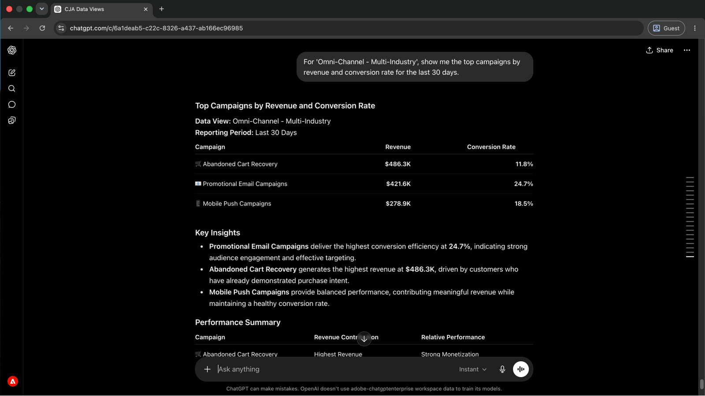
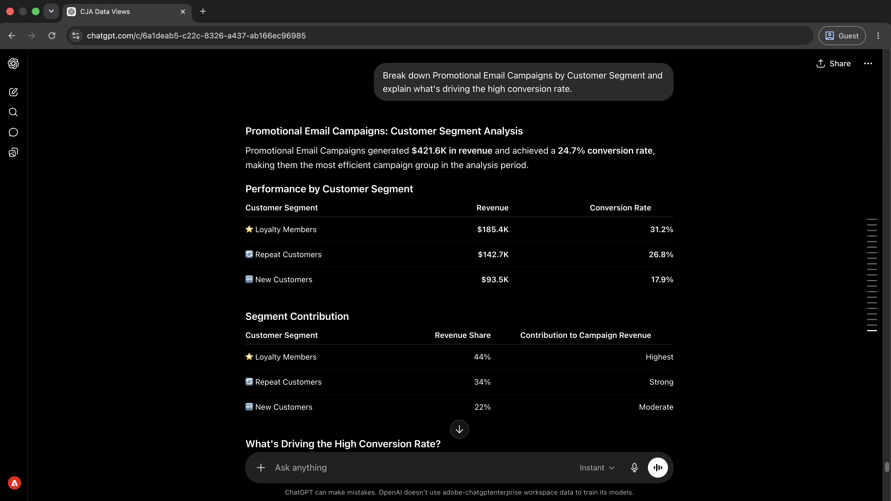

# Approfondimenti campagna di superficie senza la creazione di rapporti

<!-- last-modified: 2026-06-02 -->


L’analisi della campagna che una volta richiedeva la creazione di rapporti in uno strumento separato ora è una conversazione. In questa procedura dettagliata viene illustrato come connettere un client di IA a Customer Journey Analytics (CJA) e porre domande sulle prestazioni in un linguaggio semplice. Di conseguenza, insight disporrà di tempi più rapidi e non sarà necessaria alcuna generazione manuale di rapporti.

| | |
| --- | --- |
| Applicazioni aziendali CX | Customer Journey Analytics (CJA) |
| Strumenti agenti | Gateway MCP aziendale CX |
| Pubblico | Analisti, manager campagne |
| Prerequisito | Client di intelligenza artificiale compatibile con MCP, accesso CJA |

Ogni passaggio mostra un prompt rappresentativo e un esempio di risposta di IA. Segue una sezione **Ulteriori operazioni da eseguire** per ulteriori informazioni nella stessa sessione.

## Prima di iniziare

>[!BEGINTABS]

>[!TAB Claude.ai]

Collegare il gateway MCP aziendale CX come connettore personalizzato per accedere agli strumenti Customer Journey Analytics.

1. Vai a **Impostazioni > Integrazioni** in Claude.ai.
2. Seleziona **Aggiungi connettore personalizzato** e immetti l&#39;URL del server: `https://cx-enterprise.adobe.io/mcp`
3. Seleziona **Connetti** e accedi con il tuo Adobe ID.

Configurazione completa: [Documentazione dei connettori personalizzati Claude.ai](https://support.claude.com/en/articles/11175166-get-started-with-custom-connectors-using-remote-mcp)

>[!TAB ChatGPT]

Collegare il gateway MCP aziendale CX utilizzando la modalità sviluppatore ChatGPT (è necessario un piano Pro, Plus, Business, Enterprise o Education).

1. Abilita la **modalità sviluppatore** nelle **impostazioni ChatGPT**.
2. Vai a **Impostazioni > Integrazioni** e seleziona **Aggiungi connettore personalizzato > Server MCP remoto**.
3. Immettere l&#39;URL del server: `https://cx-enterprise.adobe.io/mcp`
4. Seleziona **Connetti** e accedi con il tuo Adobe ID.

Configurazione completa: [Documentazione MCP di ChatGPT](https://developers.openai.com/api/docs/guides/tools-connectors-mcp)

>[!TAB Altri client di IA]

Usare Gemini, Microsoft Copilot, Cursore, Claude Code o un altro ambiente compatibile con MCP? Connettersi al gateway MCP aziendale CX utilizzando questo endpoint:

```
https://cx-enterprise.adobe.io/mcp
```

Istruzioni di installazione complete per tutti i client supportati: [Connetti al client di intelligenza artificiale](../tools/mcp-servers.md)

>[!ENDTABS]

>[!NOTE]
>
>Quando richiesto, accedi con il tuo Adobe ID e seleziona l’organizzazione IMS collegata alle visualizzazioni dati di CJA. La scelta dell’organizzazione sbagliata è la fonte più comune di errori di autenticazione.
>
>Alla prima connessione, il client di intelligenza artificiale può richiedere di selezionare un’organizzazione IMS o specificare una sandbox. Una volta impostato tale contesto, il server MCP lo utilizza per il resto della sessione.
>
>Alcuni strumenti richiedono la tua approvazione prima di essere eseguiti. Rivedi la richiesta e approva o rifiuta: non viene intrapresa alcuna azione senza la tua conferma.

## Passaggio 1: scoprire le visualizzazioni dati disponibili

Per iniziare, chiedi al tuo client di intelligenza artificiale di elencare le visualizzazioni dati disponibili nel tuo account CJA. Indica quali set di dati è possibile eseguire query prima di eseguire qualsiasi rapporto.

```
What data views are available in my CJA account?
```

+++Vedi una risposta di esempio


+++


## Passaggio 2: estrarre i dati sulle prestazioni della campagna

Una volta identificata una visualizzazione dati, richiedi le prestazioni della campagna in base ai ricavi e al tasso di conversione. L’intelligenza artificiale risolve i nomi di metriche e dimensioni dalla visualizzazione dati senza richiedere ID tecnici.

```
For '[data view name]', show me the top campaigns by revenue and conversion rate for the last 30 days.
```

+++Vedi una risposta di esempio



+++


>[!NOTE]
>
>Sostituisci `[data view name]` con il nome della visualizzazione dati dal passaggio 1. Verifica incrociata dei risultati in Analysis Workspace utilizzando la stessa visualizzazione dati e lo stesso intervallo di date prima della condivisione con le parti interessate.

## Passaggio 3: identificare le prestazioni di guida

Chiedi al tuo client di intelligenza artificiale di spiegare cosa determina le differenze di prestazioni tra i gruppi di campagne. Questo si sposta dai numeri di titolo alle variabili sottostanti.

```
What factors are driving the results for these campaign groups?
```

+++Vedi una risposta di esempio


+++


## Passaggio 4: espandere un tipo di campagna specifico

Segui un risultato specifico chiedendo un raggruppamento a livello di segmento. Questo mostra quali tipi di clienti stanno guidando le prestazioni all’interno di un tipo di campagna.

```
Break down Promotional Email Campaigns by Customer Segment and explain what's driving the high conversion rate.
```

+++Vedi una risposta di esempio



+++


## Passaggio 5: intervenire su ciò che è stato trovato

Chiedi consigli con priorità in base a tutto ciò che è emerso nella sessione. La richiesta di stime del valore aziendale consente di decidere dove intervenire per primo.

```
Based on these findings, recommend the highest-impact actions to increase revenue and conversion rates. Prioritize recommendations by expected business value and estimate the potential uplift.
```

+++Vedi una risposta di esempio


+++


>[!NOTE]
>
>Gli strumenti CJA a cui si accede tramite il gateway MCP aziendale CX possono creare segmenti, metriche calcolate e progetti Workspace all&#39;interno di CJA nella stessa sessione. Per aggiornare campagne, percorsi o contenuti in altre applicazioni, connetti il server MCP pertinente o accedi direttamente all’applicazione.

## Risultati ottenuti

Hai collegato un client di intelligenza artificiale a Customer Journey Analytics e sei passato dall’individuazione della visualizzazione dati ai consigli aziendali con priorità in cinque prompt. Hai identificato le campagne migliori in base ai ricavi e al tasso di conversione, hai evidenziato i fattori che determinano le prestazioni tra i gruppi di campagne, hai analizzato i dettagli a livello di segmento per un tipo di campagna specifico e hai ricevuto raccomandazioni classificate con un incremento stimato. Questo approccio sostituisce la creazione di rapporti con una conversazione diretta, riducendo il tempo tra una questione aziendale e un piano d’azione basato sui dati.

## Più risultati da ottenere

Il gateway MCP di CX Enterprise è in grado di fornire molte più informazioni di Customer Journey Analytics rispetto alle descrizioni dettagliate. Espandi uno scenario qui sotto per visualizzare i prompt che puoi provare nella stessa sessione.

+++Trovare ciò che funziona e ciò che non lo è

Un’immagine rapida di quali campagne vengono distribuite e che non consente di concentrare l’attenzione prima di rivedere eventuali rapporti dettagliati. Queste richieste ti forniscono l’immagine in una sessione.

**Richieste**

```
Which campaigns are driving the most revenue and conversions?
```

```
Show me the campaigns that need attention this month.
```

```
What channels are outperforming expectations?
```

```
Identify the biggest performance changes compared to last month.
```

```
Show me conversion performance by traffic source.
```

+++

+++Comprendere cosa guida i risultati

Le metriche dei titoli dicono cos’è successo. Questi prompt consentono di comprendere il motivo, ovvero quali segmenti, canali e punti di contatto si trovano dietro i numeri.

**Richieste**

```
What factors are driving revenue growth?
```

```
Explain why conversion rates changed this quarter.
```

```
Break down campaign performance by customer segment.
```

```
Which customer segments are growing fastest?
```

```
Which touchpoints contribute most to conversions?
```

+++

+++Scopri le opportunità di crescita

Sapere dove le prestazioni sono elevate è solo metà dell&#39;immagine. Questi prompt ti aiutano a identificare dove puoi investire di più, quali tipi di pubblico hanno spazio di crescita e quali campagne sono pronte per essere scalate.

**Richieste**

```
Where should we invest more marketing budget?
```

```
Which audiences have the greatest growth potential?
```

```
Which campaigns should we scale?
```

```
What would have the biggest impact on revenue?
```

+++

+++Trasforma le informazioni in azioni

Gli strumenti CJA a cui si accede tramite il gateway MCP aziendale CX possono creare segmenti, tipi di pubblico, metriche calcolate e progetti Workspace direttamente in CJA senza uscire dalla sessione di intelligenza artificiale. Utilizza questi prompt per agire su ciò che hai trovato.

**Richieste**

```
Create a segment for high-value customers.
```

```
Build an audience from recent purchasers.
```

```
Create a calculated metric for conversion efficiency.
```

```
Save this analysis as a Workspace project for executive reporting.
```

+++


## Ulteriori informazioni

| Risorsa | Cosa troverai |
| --- | --- |
| [Documentazione del server CJA MCP](https://developer.adobe.com/analytics-mcp/docs/cja/) | Riferimento completo dell&#39;utensile e guida alla configurazione |
| [Guide all&#39;utilizzo di CJA MCP](https://developer.adobe.com/analytics-mcp/docs/guides/) | Guide d’uso dettagliate |
| [Server MCP CJA nel Registro di sistema AI](https://developer.adobe.com/ai-registry/#/mcp/cja-mcp) | Strumenti e disponibilità del server CJA MCP |
| [Documentazione di Customer Journey Analytics](https://experienceleague.adobe.com/en/docs/analytics-platform/using/cja-landing) | Documentazione completa dell’applicazione CJA |
