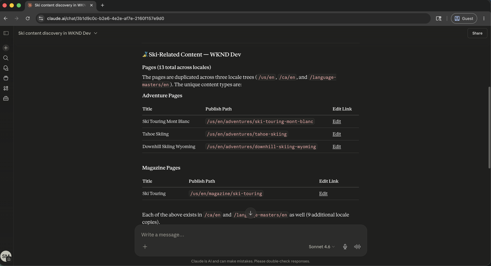

# Aggiornamenti più rapidi per mantenere aggiornati i contenuti

<!-- last-modified: 2026-05-22 -->

{zoomable="yes"}

*Selezionare per ingrandire.*

Mantenere aggiornato il contenuto del sito web è una pressione operativa costante. Questa procedura dettagliata mostra come i team di contenuto possono trovare, rivedere, aggiornare e pubblicare pagine e frammenti di contenuto di AEM tramite un client AI, utilizzando AEM Content MCP Server per ridurre il tempo tra una decisione sui contenuti e un aggiornamento live.

| Dettagli scenario | |
| --- | --- |
| Applicazioni aziendali CX | [Adobe Experience Manager as a Cloud Service](https://experienceleague.adobe.com/it/docs/experience-manager-cloud-service/content/overview/introduction) |
| Strumenti agenti | [Server AEM Content MCP](https://experienceleague.adobe.com/it/docs/experience-manager-cloud-service/content/ai-in-aem/using-mcp-with-aem-as-a-cloud-service) |
| Pubblico | Manager contenuti, team di marketing |
| Prerequisito | Client di intelligenza artificiale compatibile con MCP, accesso AEM as a Cloud Service |

Ogni passaggio mostra un prompt rappresentativo e un esempio di risposta di IA. Segue una sezione **Ulteriori operazioni da eseguire** per ulteriori informazioni nella stessa sessione.

## Prima di iniziare

>[!BEGINTABS]

>[!TAB Claude.ai]

Connetti il server AEM Content MCP come connettore personalizzato.

1. Vai a **Impostazioni > Integrazioni** in Claude.ai.
2. Seleziona **Aggiungi connettore personalizzato** e immetti l&#39;URL del server: `https://mcp.adobeaemcloud.com/adobe/mcp/content`
3. Seleziona **Connetti** e accedi con il tuo Adobe ID.

Configurazione completa: [Documentazione dei connettori personalizzati Claude.ai](https://support.claude.com/en/articles/11175166-get-started-with-custom-connectors-using-remote-mcp)

>[!TAB ChatGPT]

Connetti il server AEM Content MCP utilizzando la modalità sviluppatore ChatGPT (è necessario un piano Pro, Plus, Business, Enterprise o Education).

1. Abilita la **modalità sviluppatore** nelle **impostazioni ChatGPT**.
2. Vai a **Impostazioni > Integrazioni** e seleziona **Aggiungi connettore personalizzato > Server MCP remoto**.
3. Immettere l&#39;URL del server: `https://mcp.adobeaemcloud.com/adobe/mcp/content`
4. Seleziona **Connetti** e accedi con il tuo Adobe ID.

Configurazione completa: [Documentazione MCP di ChatGPT](https://developers.openai.com/api/docs/guides/tools-connectors-mcp)

>[!TAB Altri client di IA]

Usare Gemini, Microsoft Copilot, Cursore, Claude Code o un altro ambiente compatibile con MCP? Connettiti al server AEM Content MCP utilizzando questo endpoint:

```
https://mcp.adobeaemcloud.com/adobe/mcp/content
```

Istruzioni di installazione complete per tutti i client supportati: [Connetti al client di intelligenza artificiale](../tools/mcp-servers.md)

>[!ENDTABS]

>[!NOTE]
>
>Quando richiesto, accedi con il tuo Adobe ID e seleziona l’organizzazione IMS collegata al tuo ambiente AEM as a Cloud Service. Le autorizzazioni vengono applicate a livello di AEM. Il client di intelligenza artificiale può eseguire solo operazioni per le quali il tuo account è autorizzato.
>
>Se è sufficiente sfogliare o controllare il contenuto senza apportare modifiche, utilizzare l&#39;endpoint del server di sola lettura: `https://mcp.adobeaemcloud.com/adobe/mcp/content-readonly`. Tutti i prompt di individuazione e revisione in questa pagina funzionano con entrambi i server.
>
>Alla prima connessione, il client di intelligenza artificiale potrebbe richiedere di confermare l’organizzazione o l’ambiente AEM. Una volta impostato tale contesto, il server MCP lo utilizza per il resto della sessione.
>
>Alcuni strumenti richiedono la tua approvazione prima di essere eseguiti. Esamina l’azione proposta e approva o rifiuta. Nessuna modifica viene apportata senza la tua conferma.

## Passaggio 1: trovare i contenuti nell’ambiente AEM

Per iniziare, chiedi al tuo client di intelligenza artificiale di individuare gli ambienti AEM e cercare contenuti. Puoi eseguire ricerche per argomento, parola chiave o tipo di contenuto senza conoscere percorsi esatti.

```
From WKND Dev environment, find all ski related content.
```

+++Vedi una risposta di esempio

{zoomable="yes"}

*Selezionare per ingrandire.*

+++


## Passaggio 2: rivedere una pagina specifica

Dopo aver individuato il contenuto rilevante, chiedi al tuo client di intelligenza artificiale di mostrarti una pagina specifica. È possibile fare riferimento alle pagine per nome o percorso. Il server MCP risolve il riferimento e restituisce la struttura del contenuto.

```
Show me the US English Home Page.
```

+++Vedi una risposta di esempio

{zoomable="yes"}

*Selezionare per ingrandire.*

+++


## Passaggio 3: migliorare il contenuto

Con il contenuto della pagina visualizzato, chiedi al tuo client di intelligenza artificiale di suggerire o applicare miglioramenti. L’intelligenza artificiale può proporre modifiche alla copia in base a ciò che la pagina dice attualmente e chiedere conferma prima di scrivere qualsiasi cosa.

```
Improve the Hero CTAs.
```

+++Vedi una risposta di esempio

{zoomable="yes"}

*Selezionare per ingrandire.*

+++


>[!CAUTION]
>
>Quando richiesto, confermare ogni modifica. Il server AEM Content MCP può creare, aggiornare ed eliminare contenuti. Rivedi la modifica proposta prima di approvarla, in particolare sulle pagine live.

## Passaggio 4: pubblicare e condividere

Dopo aver confermato l’aggiornamento, pubblica la pagina e recupera un URL condivisibile, tutto nella stessa conversazione.

```
Publish the changes and share the URL.
```

+++Vedi una risposta di esempio

{zoomable="yes"}

*Selezionare per ingrandire.*

+++


## Risultati ottenuti

Hai utilizzato il server AEM Content MCP per trovare i contenuti, esaminare una pagina live, applicare i miglioramenti suggeriti dall’intelligenza artificiale e pubblicare i risultati, senza aprire l’interfaccia di AEM. Combinando l’individuazione, la modifica e la pubblicazione dei contenuti in un’unica sessione di intelligenza artificiale, i team di contenuto possono passare dall’identificazione di un gap alla spedizione e alla distribuzione di un aggiornamento più rapidamente e con un numero inferiore di opzioni di contesto. Lo stesso flusso di lavoro viene ridimensionato a più pagine, frammenti di contenuto e avvii coordinati di campagne.

## Più risultati da ottenere

Il server AEM Content MCP gestisce molto di più delle operazioni descritte nella procedura dettagliata. Espandi uno scenario qui sotto per visualizzare i prompt che puoi provare nella stessa sessione.

+++Anticipare la revisione o il rilancio di un sito

I controlli dei contenuti, se eseguiti manualmente, richiedono molto tempo. Questi prompt consentono di visualizzare rapidamente contenuti non aggiornati, bozze mai spedite e spazi vuoti che devono essere corretti prima di un&#39;operazione push importante.

**Richieste**

```
Show me everything updated in the last two weeks.
```

```
What content is sitting in draft and hasn't been published yet?
```

```
Find pages that haven't been touched in over a year.
```

```
Which pages are missing their description field?
```

```
We're reorganizing the taxonomy. Find all articles missing tags or categories.
```

+++

+++Correggere i problemi di SEO (Search Engine Optimization) e accessibilità su larga scala

Le lacune SEO (Search Engine Optimization) e accessibilità si accumulano rapidamente nei siti di grandi dimensioni. Questi prompt consentono di individuare e assegnare la priorità ai problemi più importanti prima di un controllo o di un avvio.

**Richieste**

```
Pull a list of all pages with an empty meta description.
```

```
Which pages have thin content that's likely to underperform for SEO?
```

```
Find all images missing alt text.
```

```
Our CTAs aren't consistent. Scan the site and flag anywhere the call-to-action wording differs from "Book now."
```

```
The homepage was updated yesterday. Show me what changed compared to the version before.
```

+++

+++Mantieni la libreria di risorse organizzata e pronta

I riferimenti alle risorse interrotti e i caricamenti non elaborati rallentano la produzione dei contenuti. Queste richieste ti aiutano a trovare e gestire le risorse prima che bloccino un aggiornamento di pagina o una campagna.

**Richieste**

```
We're building a biking content series. What image assets do we already have?
```

```
Can you upload a placeholder asset from https://placehold.co/800x450/png to the wknd folder and save it as placeholder.png?
```

```
That asset was just uploaded. Is it processed and ready to use in a page?
```

```
I need to replace the hero image across the site. Which fragments are currently using it?
```

+++

+++Coordinare un lancio di contenuti su più pagine

L’avvio di una campagna spesso implica il coordinamento delle modifiche tra più frammenti di contenuto e pagine. Questi prompt consentono di raggruppare gli aggiornamenti, esaminare prima di promuovere e spedire in modo ordinato.

**Richieste**

```
I need to update the surfing adventure. Show me its content and all its fields.
```

```
Create an EMEA market variation of the ski adventure fragment.
```

```
Bundle everything we changed in this session into a launch called May Updates.
```

```
What launches are open right now, and which ones are ready to promote?
```

```
Before I promote, show me exactly what changed between May Updates and what is currently live.
```

```
Promote the May Updates launch to production.
```

+++


## Ulteriori informazioni

| Risorsa | Cosa troverai |
| --- | --- |
| [Server AEM Content MCP nel Registro AI](https://developer.adobe.com/ai-registry/#/mcp/aem-content-mcp){target="_blank"} | Elenco strumenti e disponibilità |
| [Documentazione su AEM as a Cloud Service](https://experienceleague.adobe.com/it/docs/experience-manager-cloud-service){target="_blank"} | Documentazione completa dell’applicazione AEM |
