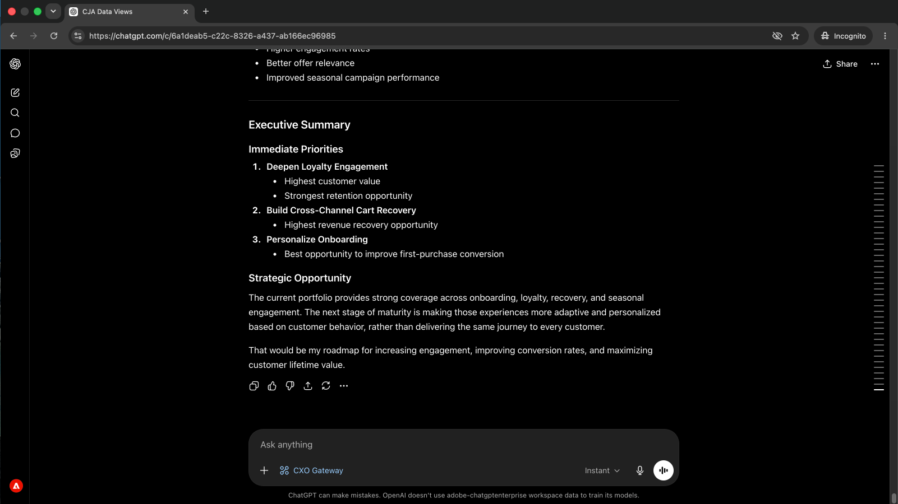
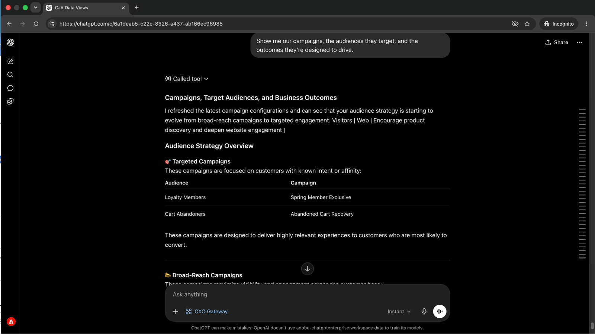
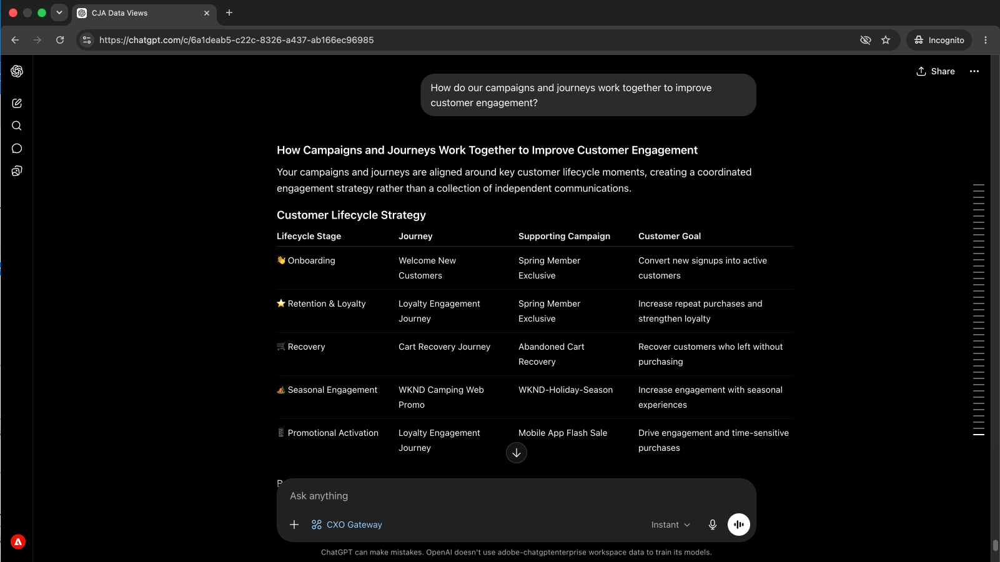

# Rileva i problemi di percorso prima che influiscano sui clienti
<!-- last-modified: 2026-06-08 -->



I problemi del percorso che non vengono rilevati possono raggiungere i clienti prima che qualcuno se ne accorga. In questa procedura dettagliata viene illustrato come essere sempre all&#39;avanguardia controllando i percorsi AJO attivi, esaminando la configurazione delle campagne e individuando i problemi operativi attraverso un client AI, utilizzando CX Enterprise MCP per ottenere risposte in linguaggio semplice senza aprire Adobe Journey Optimizer.

| Dettagli scenario | |
| --- | --- |
| Applicazioni aziendali CX | [Adobe Journey Optimizer (AJO)](https://experienceleague.adobe.com/it/docs/journey-optimizer/using/ajo-home) |
| Strumenti agenti | [MCP aziendale CX](../tools/mcp-servers.md#cx-enterprise-mcp-servers) |
| Pubblico | Manager campagne, addetti al marketing |
| Prerequisito | Client di intelligenza artificiale compatibile con MCP, accesso AJO |

Ogni passaggio mostra un prompt rappresentativo e un esempio di risposta di IA. Segue una sezione **Ulteriori operazioni da eseguire** per ulteriori informazioni nella stessa sessione.


## Prima di iniziare

>[!BEGINTABS]

>[!TAB Claude.ai]

Collegare CX Enterprise MCP come connettore personalizzato per accedere agli strumenti Adobe Journey Optimizer.

1. Vai a **Impostazioni > Integrazioni** in Claude.ai.
2. Seleziona **Aggiungi connettore personalizzato** e immetti l&#39;URL del server: `https://cx-enterprise.adobe.io/mcp`
3. Seleziona **Connetti** e accedi con il tuo Adobe ID.

Configurazione completa: [Documentazione dei connettori personalizzati Claude.ai](https://support.claude.com/en/articles/11175166-get-started-with-custom-connectors-using-remote-mcp)

>[!TAB ChatGPT]

Collegare CX Enterprise MCP utilizzando la modalità di sviluppo ChatGPT (è necessario un piano Pro, Plus, Business, Enterprise o Education).

1. Abilita la **modalità sviluppatore** nelle **impostazioni ChatGPT**.
2. Vai a **Impostazioni > Integrazioni** e seleziona **Aggiungi connettore personalizzato > Server MCP remoto**.
3. Immettere l&#39;URL del server: `https://cx-enterprise.adobe.io/mcp`
4. Seleziona **Connetti** e accedi con il tuo Adobe ID.

Configurazione completa: [Documentazione MCP di ChatGPT](https://developers.openai.com/api/docs/guides/tools-connectors-mcp)

>[!TAB Altri client di IA]

Usare Gemini, Microsoft Copilot, Cursore, Claude Code o un altro ambiente compatibile con MCP? Connettersi a CX Enterprise MCP utilizzando questo endpoint:

```
https://cx-enterprise.adobe.io/mcp
```

Istruzioni di installazione complete per tutti i client supportati: [Connetti al client di intelligenza artificiale](../tools/mcp-servers.md)

>[!ENDTABS]

>[!NOTE]
>
>Quando richiesto, accedi con il tuo Adobe ID e seleziona l’organizzazione IMS collegata al tuo ambiente AJO. La scelta dell’organizzazione sbagliata è la fonte più comune di errori di autenticazione.
>
>Alla prima connessione, il client di intelligenza artificiale può richiedere di selezionare un’organizzazione IMS o specificare una sandbox. Una volta impostato tale contesto, il server MCP lo utilizza per il resto della sessione.
>
>Alcuni strumenti richiedono la tua approvazione prima di essere eseguiti. Rivedi la richiesta e approva o rifiuta. Non viene intrapresa alcuna azione senza la tua conferma.


## Passaggio 1: scoprire i percorsi attivi e il loro scopo

Per prima cosa, è necessario fare un inventario dei percorsi attivi e degli obiettivi aziendali che ne sono alla base. Questo vi offre un quadro completo prima di immergervi in un percorso specifico.

```
What customer journeys are currently available and what business objectives do they support?
```

+++Vedi una risposta di esempio


+++


## Passaggio 2: rivedere i passaggi di un percorso e la customer experience

Con l’elenco dei percorsi visualizzato, chiedi al client di intelligenza artificiale di seguire i passaggi di un percorso specifico e spiegare cosa sperimenta il cliente in ogni fase.

```
Walk me through the [journey name] journey and explain the customer experience.
```

+++Vedi una risposta di esempio


+++


>[!NOTE]
>
>Sostituisci `[journey name]` con il nome di un percorso dai risultati del passaggio 1.


## Passaggio 3: rivedere campagne, tipi di pubblico e obiettivi

Passaggio da percorsi a campagne. Chiedi un riepilogo delle campagne attive, dei destinatari e dei risultati che sono progettate per guidare.

```
Show me our campaigns, the audiences they target, and the outcomes they're designed to drive.
```

+++Vedi una risposta di esempio



+++


## Passaggio 4: comprendere come si collegano campagne e percorsi

Chiedi al tuo client di intelligenza artificiale di collegare i punti tra campagne e percorsi e spiegare come funzionano insieme per raggiungere gli obiettivi di coinvolgimento condiviso.

```
How do our campaigns and journeys work together to improve customer engagement?
```

+++Vedi una risposta di esempio



+++


## Passaggio 5: ottenere consigli con priorità

Chiedere consigli con priorità su cosa concentrarsi successivamente, dal punto di vista di un responsabile del marketing del ciclo di vita. Questo mostra le opportunità e i gap di maggior impatto da tutto ciò che è stato rivisto nella sessione.

```
If you were our lifecycle marketing manager, what would you prioritize next and why?
```

+++Vedi una risposta di esempio


+++


>[!NOTE]
>
>Il server MCP di AJO raccoglie informazioni sul percorso e sulla campagna ma non può modificare percorsi, campagne o contenuti. Per implementare i consigli, accedi direttamente all’applicazione AJO o connetti il server AEM Content MCP per apportare modifiche al contenuto nella stessa sessione.


## Risultati ottenuti

Hai collegato un client di intelligenza artificiale a Adobe Journey Optimizer e hai creato un quadro completo del tuo percorso e del tuo portfolio di campagne attraverso cinque prompt. Hai inventariato i percorsi attivi e i loro obiettivi aziendali, analizzato l’esperienza del cliente passo per passo per un percorso specifico, mappato le campagne attive ai relativi tipi di pubblico e risultati previsti, compreso il modo in cui le campagne e i percorsi lavorano insieme e ricevuto raccomandazioni prioritarie su dove concentrarti successivamente. Questo offre visibilità strategica ai responsabili del marketing e delle campagne per il ciclo di vita senza aprire l’interfaccia di AJO.


## Più risultati da ottenere

CX Enterprise MCP è in grado di fornire una vasta gamma di dettagli sul percorso e sulla campagna AJO. Espandi uno scenario qui sotto per visualizzare i prompt che puoi provare nella stessa sessione.

+++Scopri cosa c&#39;è in diretta prima di fare un cambiamento

Apportare modifiche a un percorso senza sapere cos&#39;altro è in esecuzione è rischioso. Questi prompt forniscono un inventario aggiornato delle funzioni attive, delle modifiche apportate di recente e del modo in cui vengono configurate le campagne.

**Richieste**

```
Show me all journeys modified in the last 7 days.
```

```
Show me all journeys that use SMS as a channel.
```

```
Which campaigns are scheduled to end this week?
```

```
What loyalty challenges are currently active?
```

+++

+++Approfondisci i dettagli di un percorso specifico

Quando devi rivedere, approvare o consegnare un percorso, avere davanti a te la logica completa senza aprire AJO ti fa risparmiare tempo. In questo modo vengono visualizzate le condizioni di superficie, i programmi e le regole di segmento su richiesta.

**Richieste**

```
What is the entry condition for the [journey name] journey?
```

```
What are the exit conditions and timeout rules for the [journey name] journey?
```

```
What messages and wait conditions are in the [journey name] journey?
```

```
Which segment does the [journey name] journey target?
```

+++

+++Approfondisci i dettagli di una campagna specifica

Quando devi rivedere la configurazione completa di una campagna prima di approvarla, distribuirla o apportare modifiche, queste richieste emergono dalle regole del pubblico, dalle impostazioni del canale e dai dettagli della pianificazione senza aprire AJO.

**Richieste**

```
Walk me through the full configuration of the [campaign name] campaign.
```

```
What audience does the [campaign name] campaign target and how large is that segment?
```

```
What frequency cap and send schedule apply to the [campaign name] campaign?
```

```
Are any campaigns targeting overlapping audiences?
```

```
What channel configurations are set up in our AJO environment?
```

+++


## Ulteriori informazioni

| Risorsa | Cosa troverai |
| --- | --- |
| [Server AJO MCP nel Registro di sistema AI](https://developer.adobe.com/ai-registry/#/mcp/ajo-mcp-server){target="_blank"} | Strumenti e disponibilità del server AJO MCP |
| [Documentazione di AJO](https://experienceleague.adobe.com/it/docs/journey-optimizer/using/ajo-home){target="_blank"} | Documentazione completa dell’applicazione AJO |
