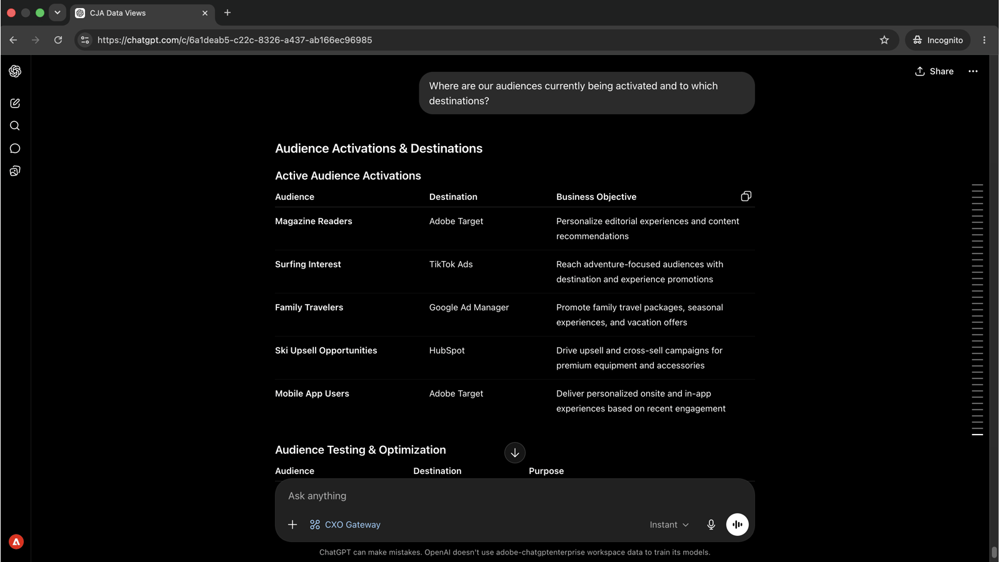

# Comprendere i tipi di pubblico e dove vengono attivati

<!-- last-modified: 2026-06-04 -->


È fondamentale sapere quali tipi di pubblico sono attivi, dove scorrono e se le destinazioni sono sane prima che venga avviata una campagna o quando le prestazioni di una sono insoddisfacenti. In questa procedura dettagliata viene illustrato come ottenere un quadro completo dell&#39;attivazione tramite un client di intelligenza artificiale, utilizzando CX Enterprise MCP per ottenere in pochi secondi lo stato del pubblico e lo stato di integrità della destinazione, senza aprire Real-Time CDP.

| Dettagli scenario | |
| --- | --- |
| Applicazioni aziendali CX | [Real-Time Customer Data Platform (Real-Time CDP)](https://experienceleague.adobe.com/it/docs/experience-platform/rtcdp/home) |
| Strumenti agenti | [MCP aziendale CX](../tools/mcp-servers.md#cx-enterprise-mcp-servers) |
| Pubblico | Addetti al marketing, analisti, operatori |
| Prerequisito | Client di intelligenza artificiale compatibile con MCP, accesso Real-Time CDP |

Ogni passaggio mostra un prompt rappresentativo e un esempio di risposta di IA. Segue una sezione **Ulteriori operazioni da eseguire** per ulteriori informazioni nella stessa sessione.

## Prima di iniziare

>[!BEGINTABS]

>[!TAB Claude.ai]

Collegare CX Enterprise MCP come connettore personalizzato per accedere agli strumenti Real-Time CDP.

1. Vai a **Impostazioni > Integrazioni** in Claude.ai.
2. Seleziona **Aggiungi connettore personalizzato** e immetti l&#39;URL del server: `https://cx-enterprise.adobe.io/mcp`
3. Seleziona **Connetti** e accedi con il tuo Adobe ID.

Configurazione completa: [Documentazione dei connettori personalizzati Claude.ai](https://support.claude.com/en/articles/11175166-get-started-with-custom-connectors-using-remote-mcp)

>[!TAB ChatGPT]

Collegare CX Enterprise MCP utilizzando la modalità di sviluppo ChatGPT (è necessario un piano Pro, Plus, Business, Enterprise o Education).

1. Abilita la **modalità sviluppatore** nelle **impostazioni ChatGPT**.
2. Vai a **Impostazioni > Integrazioni** e seleziona **Aggiungi connettore personalizzato > Server MCP remoto**.
3. Immettere l&#39;URL del server: `https://cx-enterprise.adobe.io/mcp`
4. Seleziona **Connetti** e accedi con il tuo Adobe ID.

Configurazione completa: [Documentazione MCP di ChatGPT](https://developers.openai.com/api/docs/guides/tools-connectors-mcp)

>[!TAB Altri client di IA]

Usare Gemini, Microsoft Copilot, Cursore, Claude Code o un altro ambiente compatibile con MCP? Connettersi a CX Enterprise MCP utilizzando questo endpoint:

```
https://cx-enterprise.adobe.io/mcp
```

Istruzioni di installazione complete per tutti i client supportati: [Connetti al client di intelligenza artificiale](../tools/mcp-servers.md)

>[!ENDTABS]

>[!NOTE]
>
>Quando richiesto, accedi con il tuo Adobe ID e seleziona l’organizzazione IMS collegata alla tua istanza Real-Time CDP. La scelta dell’organizzazione sbagliata è la fonte più comune di errori di autenticazione.

## Passaggio 1: scopri i tipi di pubblico e cosa rappresentano

Per iniziare, chiedi un inventario dei tipi di pubblico disponibili e dei comportamenti dei clienti acquisiti. Questo offre l’intero panorama prima di eseguire il drilling in un segmento specifico.

```
What audiences are currently available and what customer behaviors do they represent?
```

+++Vedi una risposta di esempio


+++


## Passaggio 2: identificare i segmenti più importanti

Con il panorama del pubblico in vista, chiedi quali segmenti sono più grandi e cosa li rende strategicamente preziosi.

```
Which audiences are the largest and what makes them valuable?
```

+++Vedi una risposta di esempio


+++


## Passaggio 3: rivedere l’attivazione e le destinazioni

Chiedi a dove il pubblico sta attualmente scorrendo e a quali destinazioni è attivato.

```
Where are our audiences currently being activated and to which destinations?
```

+++Vedi una risposta di esempio



+++


## Passaggio 4: ottenere consigli strategici

Gli strumenti RTCDP di CX Enterprise MCP sono di sola lettura e presentano lo stato di attivazione, lo stato della destinazione e i dati del flusso di dati, ma non modificano la configurazione. Dopo aver identificato un problema, la correzione si verifica nell’applicazione.

```
If you were our audience strategist, what would you prioritize next and why?
```

+++Vedi una risposta di esempio


+++


>[!NOTE]
>
>Gli strumenti RTCDP di CX Enterprise MCP presentano i dati di destinazione e attivazione ma non possono modificare la configurazione di destinazione, le definizioni dei segmenti o le impostazioni dei flussi di dati. I passaggi di correzione si verificano nell’applicazione Real-Time CDP.

## Risultati ottenuti

Hai collegato un client di intelligenza artificiale a Real-Time CDP e hai creato un’immagine strategica del tuo portfolio di tipi di pubblico in quattro prompt. Hai mappato i tipi di pubblico disponibili sui comportamenti dei clienti che acquisiscono, identificato i segmenti più grandi e importanti, confermato dove ciascun pubblico scorre e a quali destinazioni, e ricevuto raccomandazioni prioritarie per la tua successiva attivazione. Questo sostituisce la navigazione su più schermi Real-Time CDP con una conversazione diretta e strategica.

## Più risultati da ottenere

Gli strumenti Real-Time CDP di CX Enterprise MCP supportano un&#39;ampia gamma di query di pubblico e attivazione. Espandi uno scenario qui sotto per visualizzare i prompt che puoi provare nella stessa sessione.

+++Scopri esattamente cosa sta fluendo dove prima dell’invio di una campagna

Gli errori di attivazione non sono visibili. I tipi di pubblico cessano di fluire senza preavviso e le campagne vengono inviate a elenchi obsoleti. Questi prompt forniscono un’immagine chiara dei segmenti che raggiungono determinate destinazioni e di quando.

**Richieste**

```
Which audiences are activated to Google Ads?
```

```
Show me the activation history for the [audience name] audience.
```

```
What is the last refresh time for the [audience name] audience?
```

+++

+++Rilevare i problemi di attivazione prima che influiscano su una campagna

Una destinazione senza un’esecuzione o un segmento senza una destinazione attiva indica che la campagna potrebbe raggiungere meno persone del previsto. Questi prompt consentono di far emergere tali spazi in modo proattivo.

**Richieste**

```
Are there any audiences with no active destinations?
```

```
Are any destination dataflows showing errors right now?
```

```
Which audiences have not been updated in the last 30 days?
```

+++

+++Controlla e comprendi il tuo panorama di pubblico

Quando le dimensioni del pubblico cambiano o vengono creati nuovi segmenti, avere un inventario chiaro ti aiuta a pianificare ed evitare di attivare l’elenco sbagliato. Questi prompt forniscono tale visibilità su richiesta.

**Richieste**

```
How many profiles are in the [segment name] segment?
```

```
Show me all audiences created in the last 30 days.
```

```
Which audience has grown the most in the last 60 days?
```

```
How many total profiles are in my Real-Time CDP instance?
```

+++

+++Comprendere l’identità e la qualità dei dati

Gli spazi dei nomi di identità e i criteri di unione influiscono direttamente sui profili inclusi in un pubblico e sul modo in cui vengono risolti. Questi prompt generano dettagli di configurazione che possono spiegare dimensioni di pubblico impreviste o sovrapposizioni di profili.

**Richieste**

```
What identity namespaces are configured and which are most commonly used?
```

```
What merge policies are defined and which audiences use each one?
```

```
Are there any audiences using a non-default merge policy that could cause profile overlap?
```

+++


## Ulteriori informazioni

| Risorsa | Cosa troverai |
| --- | --- |
| [Registro di sistema di Adobe AI](https://developer.adobe.com/ai-registry/?type=mcp){target="_blank"} | Metadati e disponibilità del server MCP |
| [Documentazione di Real-Time CDP](https://experienceleague.adobe.com/it/docs/experience-platform/rtcdp/home){target="_blank"} | Documentazione completa dell’applicazione Real-Time CDP |
